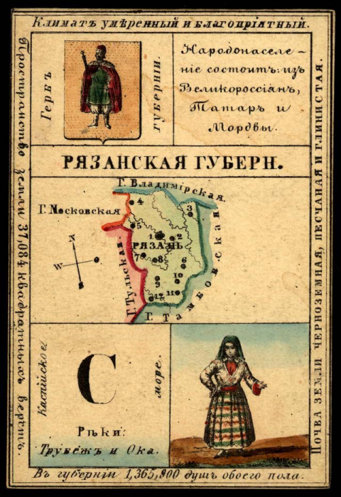
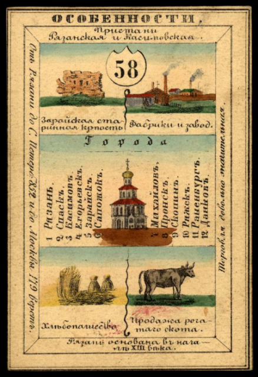
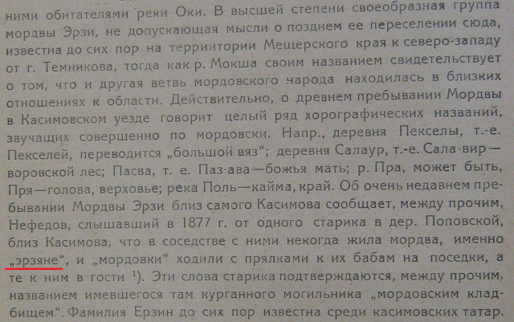
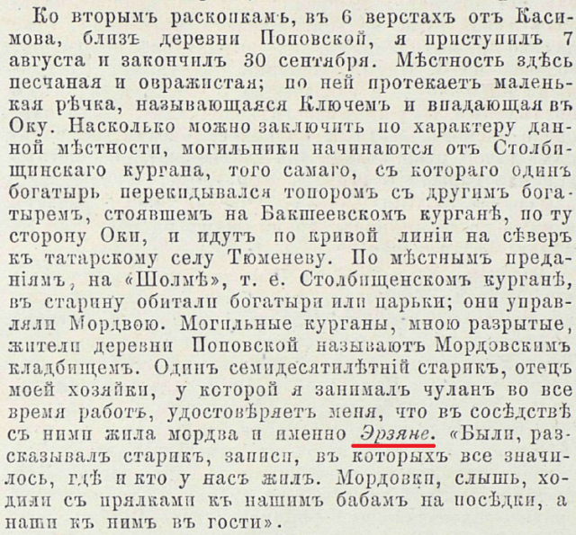

Source: [purgine LiveJournal]({{ source_url }}).

#### Губернии Российской империи (1856 год)

Открытки сувенирного набора, по одной на каждую провинцию Российской Империи в том виде, как она существовала в <b>1856</b> году.

На каждой открытке представлен обзор культуры, истории, экономики и географии провинции. На лицевой стороне открытки описаны главные отличительные особенности провинции: реки, горы, крупные города и ключевые отрасли промышленности. На оборотной стороне каждой открытки изображены карта и печать провинции, приводится информация о населении, а также изображена традиционная одежда местных жителей.

-a----        26.12.2019    11:17         782226 212424_640.png
-a----        26.12.2019    11:17        1120669 212424_original.png
-a----        26.12.2019    11:16         554060 212566_640.png
-a----        26.12.2019    11:18         365435 222294_900.png
-a----        26.12.2019    11:18         658061 222679_900.png
-a----        26.12.2019    11:15         541691 222816_640.png

[//]: # (http://pics.livejournal.com/purgine/pic/0013bz5y/s640x480)

[//]: # (http://pics.livejournal.com/purgine/pic/0013cqgk/s640x480)

Народонасление Рязанской губернии состоит великороссиян, татар и <strike>мордвы</strike>.

[Ссылка](http://memory.loc.gov/intldl/mtfhtml/mfdigcol/lists/mtfnreTitles1.html#top)

А где же это могла проживать <strike>мордва</strike> в Рязанской губернии в __1856__ году?

Да видимо все в том же Касимове:

Куфтин Б.А. Материальная культура русской мещеры Москва, 1926.

[//]: # (http://pics.livejournal.com/purgine/pic/0011zxrb/s640x480)

Нефедов Ф.Д. Раскопки курганов в Касимовском уезде. Москва, 1878.

[//]: # (http://pics.livejournal.com/purgine/pic/0011ycb5/s640x480)
